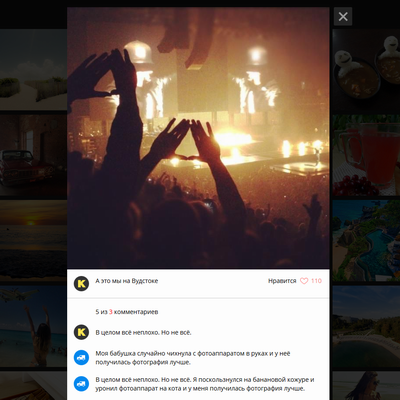

# Личный проект «Кекстаграм» (WIP)

* Студент: [Антон Леонидович](https://up.htmlacademy.ru/javascript/18/user/948947).
* Наставник: `Сам себе наставник. Царь репозитория`.

---
### Описание
Кекстаграм — сервис просмотра изображений. Проект интенсива *«JavaScript. Профессиональная разработка веб-интерфейсов»*. Форкнул для самостоятельной разработки в синтаксисе ES6. Демонстрация навыков программирования. Дизайн, контент, HTML и CSS - собственность HTML-академии. Весь JavaScript-код полностью мой. Проект находится в стадии разработки и готов только процентов на 30.

[Посмотреть готовую работу](https://utavegu.github.io/948947-kekstagram-18/)

---

